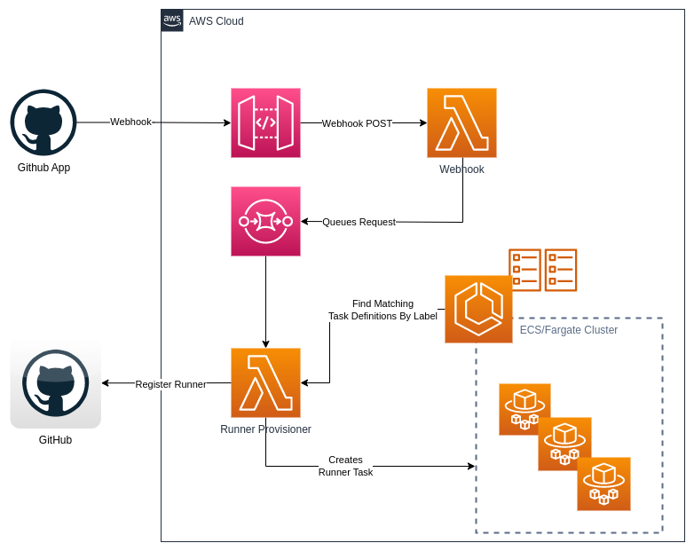

# Fargate GitHub Runners
](https://conventionalcommits.org)

:warning: This repository is a demonstration of running  GH runner on AWS ECS Fargate. Whilst it is functional I have not personally tested this at scale so please bare this in mind. I suggest before using this that you check out the Caveats section first. As usual feedback and improvements are welcome.

- [Fargate GitHub Runners](#fargate-github-runners)
  * [What Is It?](#what-is-it)
  * [Why?](#why)
  * [Read me First](#read-me-first)
    + [Caveats and Important Notes](#caveats-and-important-notes)
    + [Limits & Quotas](#limits--quotas)
    + [Not Yet Implemented](#not-yet-implemented)
- [Solution Overview](#solution-overview)
- [Setup](#setup)
  * [Creating a GitHub App](#creating-a-github-app)
  * [Configuring Webhooks](#configuring-webhooks)
  * [Building Lambdas and Container Images](#building-lambdas-and-container-images)
  * [Deploy Resources](#deploy-resources)

## What Is It?
This repository is a demonstration of running Ad-Hoc Emphemeral GitHub Runners on AWS ECS. The project borrows ideas (and some terraform) from the *excellent* [Terraform AWS GitHub Runner](https://github.com/philips-labs/terraform-aws-github-runner). If you are looking for battle tested solution to running GH Runners on EC2 VMs then please head over there.

## Why?
I was working on a project that was heavily ECS/Fargate based that needed self-hosted runners for executing integration test-packs within a VPC. Rather than simply using VM runners I thought it would be neat to try and use a container based solution instead.
If you have other uses for this I would be interested to hear.

## Read me First
### Caveats and Important Notes
* If you are looking for a VM based solution head over to: [Terraform AWS GitHub Runner](https://github.com/philips-labs/terraform-aws-github-runner)
* Fargate does not support running container based jobs from within the runner. AFAIK Docker-In-Docker setups are not possible on Fargate.
* Currently this has been built with Fargate in mind, but in theory this can just as easily work on ECS. I will look to testing and if necessary extending this for use on ECS. If you try it and it works please let me know.
* Pulling images over a NAT Gateway can incur a lot of transfer costs. PLease consider using an S3 Gateway Endpoint to avoid this. (See the example TF).
* The containers currently run as non-root. If you require additional tooling to be installed it may be bake these into the container images at build time.
* Fargate has a 200GB Limit on ephemeral storage. It may be possible to attach additional volumes; however this is not implemented currently. See: https://docs.aws.amazon.com/AmazonECS/latest/developerguide/fargate-task-storage.html
* Pulling container images on Fargate is not the fastest of processes and it may take a minute for the runners to launch.

### Limits & Quotas
* The solution makes use of SSM secret values for storing credentials and config. A configurable cache has been added that reduces the number of calls to SSM; however you may want to look into increasing throughput if you hit limits. See: https://docs.aws.amazon.com/general/latest/gr/ssm.html
* ECS also has Quotas and Limits. Please review these: https://docs.aws.amazon.com/AmazonECS/latest/developerguide/service-quotas.html

### Not Yet Implemented
* Currently this solution only supports Ad-Hoc creation of epehemeral Runners.
* I have not added proxy or custom endpoint support yet, but this should be fairly trivial to add.
* I don't have access to a GH enterprise so the Runners only operate on a Org or Repo currently.
* Windows runners - Though this should be possible!

# Solution Overview
1. The solution utilises a GitHub App which installed in your GH account (see setup)
2. A webhook is then configured on the app or directly on a specific repo that fires when a new Workflow Job is queued.
3. The job will queue the message in SQS to be picked up by the runner Lambda.
4. The Lambda runner will search the accounts ECS Task definitions for a configured prefix and find the first task definition that matches the requested labels.
5. If a matching task definition is found then the runner lambda will create a new GH Runner Registration Token and insert thisin SSM for the Runner to pick up.
7. The lambda will run a new Task in the configured cluster and subnet(s). The Task is launched with the configured Security groups and Task role.
8. The Runner Task will fetch its registration token from SSM on startup and start the GH runner process.
9. Once the GH Workflow is complete the Runner will de-register itself, remove it's token from SSM and exit.



# Setup

## Prerequisites
Before proceeding you first need to decide if you want your Runners to be registered beneath each repository where the App is installed or if they are to be registered as an organization Runner. You then need to decide if you would like to configure the webhook globally across all repos it is installed in, or if you would like to setup the webhook explicitly on each repository. The instructions will make clear the process for both options.

## Creating a GitHub App
1. Open the Developer Settings Page **Settings > Developer Settings**
2. Click **Create New App** and complete the form as  follows:
3. Name for this app. Use something self explanatory eg. "GH Fargate Runner"
4. Enter a Description (optional)
5. HomePage URL - This is just for informational purposes and can be any URL. It is not used by the Runner.
6. Disable the webhook for now. We will configure this later if required.
7. Navigate to the **Permission Tab** on the Left-hand side.
8. Permissions for all runners:
    - Repository:
      - `Actions`: Read-only
      - `Metadata`: Read-only (default/required)
9. _Permissions for repo level runners only_:
   - Repository:
     - `Administration`: Read & write (to register runner)
10. _Permissions for organization level runners only_:
    - Organization
      - `Self-hosted runners`: Read & write (to register runner)
11. Save the new app.
12. On the General page, make a note of the "App ID" and "Client ID" parameters.
10. Generate a new private key for the app and download it. Keep this safe.

## Building Lambdas and Container Images
This assumes you have Docker or compatible tooling for building container images. It also requires at least Node 16.x >
The below assumes you have already created an ECR registry. If not, see the example terraform for reference on how to do this.

NB. Currently the zip files and container images are not published, but I will endeavour to get around to this.

### Runner Images

```bash
# checkout the repository
git clone https://github.com/james-bjss/fargate-aws-github-runner.git

# Enter the images directory
cd fargate-aws-github-runner/images/ubuntu

# build and tag the image
docker build . -t <your_image_tag>

# Login to ECR and Push this image.
# As per your ECR setup - There is an example of doing this in GHA.
# Else see: https://docs.aws.amazon.com/AmazonECR/latest/userguide/docker-push-ecr-image.html
```

### Lambda Zips
```bash
# Enter the runner lambda directory
cd fargate-aws-github-runner/lambda/runner
npm -i
npm run build
npm run lambda:zip

cd ../webhook
npm -i
npm run build
npm run zip:lambda

# The Zips should be output to the relevant lambda/dist directories
```

## Deploy AWS Resources
A demo is provided [here](https://github.com/james-bjss/fargate-aws-github-runner/blob/develop/examples/fargate-complete/example.tf)

## Configuring Webhooks
Webhooks can be configured in 2 ways.
1. Directly on the repository that wishes to use the Runners.
2. Configured on the Github App itself.
